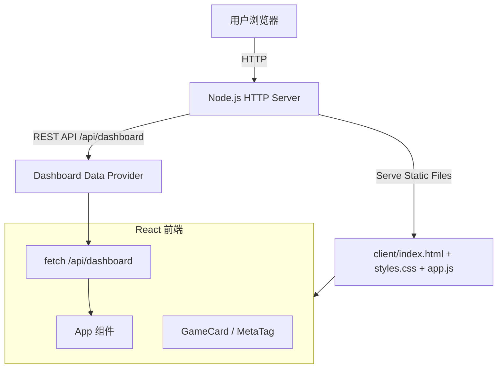

# 游戏大厅复刻项目架构图

```mermaid
flowchart TB
    User[用户浏览器] -->|HTTP| Node[Node.js HTTP Server]
    Node -->|Serve Static Files| Static[client/index.html + styles.css + app.js]
    Node -->|REST API /api/dashboard| API[Dashboard Data Provider]

    subgraph Frontend[React 前端]
      App[App 组件]
      Components[GameCard / MetaTag]
      DataFetch[fetch /api/dashboard]
    end

    Static --> Frontend
    API --> DataFetch
    DataFetch --> App
```

## 说明
- 前端使用 React（ES Module）渲染导航、分区和游戏卡片。
- 后端使用 Node.js 原生 HTTP 服务静态页面与 API。
- 前端通过 `/api/dashboard` 拉取游戏数据，页面结构和内容可解耦维护。
